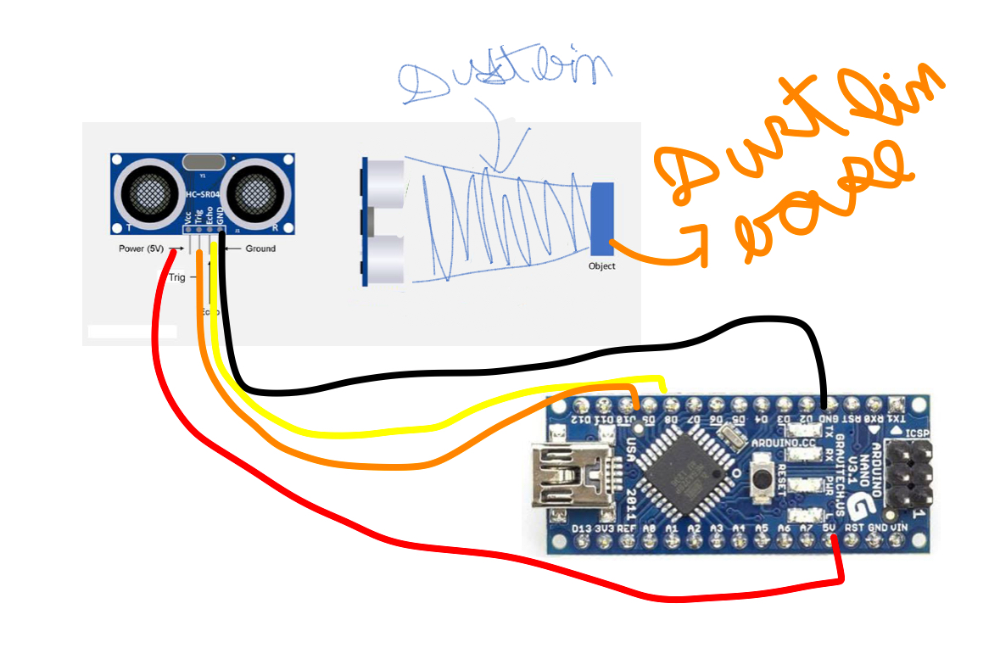
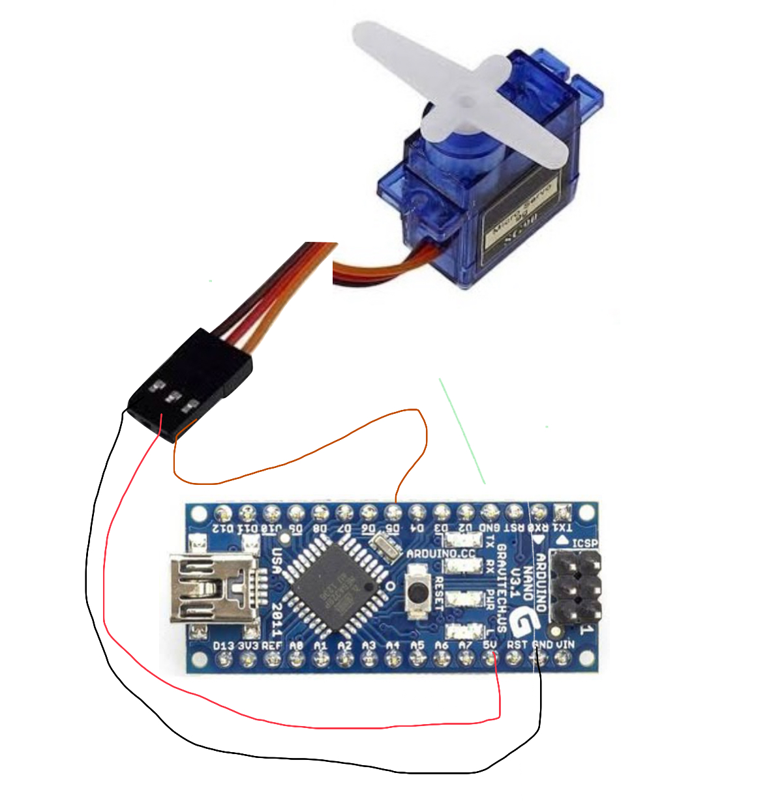

# JOURNAL

| Title | Binny The Smart Bin|
|-------|---------------------|
| Author | ARMAAN SONI  |
| Slack Id | U091M21518T (@AMU)|
| Description | Binny is a Smart Dustbin ,Clean your Dustbin on your desk ,Get Your Recyle bin deleted by it  |
| Created  | 2025-08-28 |
| Last Updated  | 2025-08-29 |
| Total Time Till date| 4 Hours|
## **28 AUG 2025 (Idea and Research and Development)**

### *(8AM-10AM)(70-75min -> RND ,35-40 min -> Test Code)*
the Idea of binny was not orignally mine ,it was brainstromed by Someone (if you know you know), but yah i started reseraching and seeing some videos for inspirtation 
and Decided that i can make such dustbin by ardiuno nano and ultrasonic sensor thus i saved sime datasheets for ultrasonic sensor to read later and finalized the circuit but before that I needed 
to confirm that how could I control Action and Delete Files From Recycle Bin , Hmm after understanding and taking some help from my Sister (She is A software Developer) I decided to make 
a test Script For Arduino Nano To just Pass (Triger) to serial out put which would be read by Python script running at the background, I used serial library and Tested The Functioning ,uhh i 
don't why it happens to me only I forgot to write code in my laptop to track coding time but though I making a journal so keeping an acurtae track of everything

### *(4PM-4:30PM)(Debuging)*
The code Which i Wrote Before Had Some Compiling issues so i look out some of errors and corrected them ,as i was writing arduino code after a long times so mistake happened but now it was fully working ,so the logic of the code is that if press the rest buuton on nano it runs the code and the as toldabove the python scripts read the trigger command running at the background
Here Is the Test Code And a Video
.png)
.png)
https://github.com/user-attachments/assets/c9c88c73-746b-45f9-b7a5-462e45f7a41d

### *(8PM-9:30PM)(Final Circuit)*
As i had Tested the Nano Functionality with recycle bin in windows now it was time to make the Final Circuit with ultrasonic sensor i went to a local shop and bought a cheap ultrasonic sensor worth $1 and went through many youtube tutorials to learn more about ultrasonic sensors and read the saved datasheet ,and connected the eco , trig, vcc , gnd to nano and now only final code was left to 
,but before that i had to make a work flow and a reference of the circuit and logic, hmm after many thoughts  I decided to the make a single standalone device which can be installed on any dust bin. 
the logic will be that i will add the empty depth of the dustbin and then write a simple but effective code that if the height of the bin is equal to readings made by ultrasonic sensor (empty case) it Sends Trigger Command to python script then the same script clear the recyle bin but if the empty height is not equal to what ultrasonic senor could read it would SenD a command that currently dustbins is filled 
I would make a python app which could be run in any device and shows real status of the bin , also in future I would add lights and more sensors to this device but for now i am only doing a straight forward process

 
